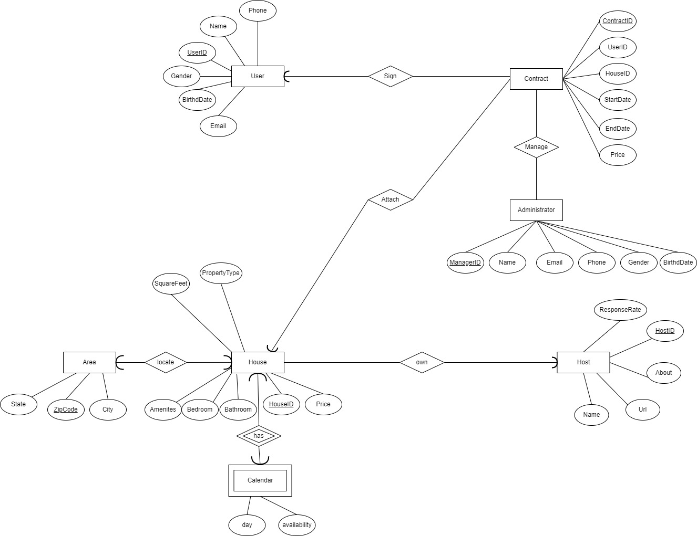
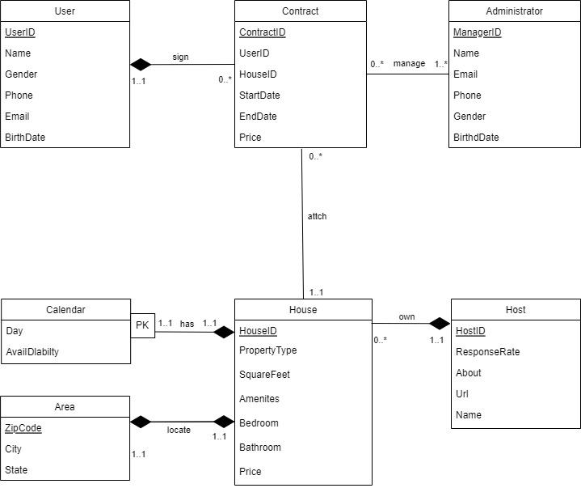

### Stage 2: Conceptual and Logical Database Design

#### Entity-Relationship Diagram



#### UML Diagram


**1.Description for each Entity**

1. User: The platform user, which has primary key UserID and other attributes such as Name, Gender, Phone Number, Email and BirthdDate.

2. Administrator: The platform administrator, whose attributes are similar to users, has such attributes as Name, Gender, Phone Number, Email and BirthdDate, and can manage transaction contracts.

3. Contract: The Contract is related to User and House, which has primary key ContractID and Foreign Key UserID, HouseID. In addition, Contract has other attributes StartDate, EndDate and Price.

4. Calendar: contains information about the availabilitys of the house in each day.

5. Area: contains information about the area where the house locate in. The primary key is the ZipCode.

6. Host: The host of the properties, which has primary key HostID, and other attributes Name, ResponseRate, About, and Url. It has a relationship with House.

7. House: The house of the host, which has primary key HouseID, and other attrubutes PropertyType, SquareFeet, Price, Bathroom, Bedroom, Amenites. It's owned by host, has the calender, located at the area and attached with the contract.

**2.Description for each Relationship**

1. Manage: The relationship between Administrator and Contract. We assume that a platform administrator can manage multiple contracts, and one contract must be managed by at least one administrator. The platform administrator can review the content of the lease contract and modify the lease term of the contract.

2. Locate: The relationship between House and Area, it is a many to one relation which means multiple houses can locate in the same district.

3. Has: The relationship between House and Calendar, it is a one to one relation which means that every house have and only have one calendar which is used to check the availability of the house.  

4. Own: The relationship between House and Host, it is a one to many relation which means a host can own multiple houses.

5. Sign: The relationship between User and Contract, it is a one to many relation which means a User can sign multiple caontracts.

6. Attach: The relationshio between House and Contract, it is a one to many relation which means a House can attach multiple caontracts.


#### Logical design

```sql
House(
    HouseID:       VARCHAR(20) [PK],
    name:          VARCHAR(255),
    PropertyType:  VARCHAR(20),
    RoomType:      VARCHAR(30),
    Amenites:      VARCHAR(20),
    Bedroom:       INT,
    Bathroom:      INT,
    Beds:          INT,
    Price:         REAL,
)

Host(
    HostID:        VARCHAR(20) [PK],
    ResponseRate:  REAL,
    About:         VARCHAR(255),
    Url:           VARCHAR(255),
    Name:          VARCHAR(20),
)

Administrator(
    ManagerID:     INT [PK], 
    Name:          VARCHAR(255),
    Email:         VARCHAR(255),
    Phone:         INT,
    Gender:        VARCHAR(255),
    BirthdDate:    Date
)

User(
    UserID:        VARCHAR(20) [PK], 
    Name:          VARCHAR(255),
    Gender:        VARCHAR(255),
    Phone:         INT,
    Email:         VARCHAR(255),
    BirthDate:    Date
)

Calendar(
    HouseID:       INT [FK to House.HouseID],
    Day:           Date,
    Availability:  INT
)

Area(
    ZipCode:       VARCHAR(10) [PK], 
    City:          VARCHAR(255), 
    State:         VARCHAR(255)
)

Contract(
    ContractID:    INT [PK], 
    UserID:        INT [FK to User.UserID],
    HouseID:       INT [FK to House.HouseID],
    StartDate:     Date,
    EndDate:       Date,
    Price:         REAL
)

```
