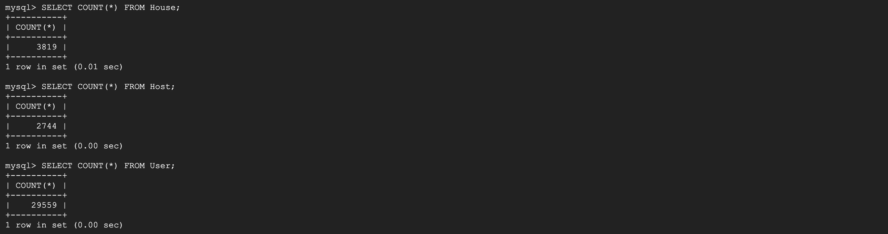

### Database implementation

#### Implementing the database tables on GCP

#### DDL Commands 
```sql
CREATE TABLE Adminsitrator (
  ManagerID   int,
  Name        varchar(255),
  Email       varchar(255),
  Phone       int,
  Gender      varchar(255),
  BirthdDate  date,
  PRIMARY KEY (ManagerID)
  )
  
CREATE TABLE Area (
  Zipcode  int,
  City     varchar(255),
  State    varchar(255),
  PRIMARY KEY (Zipcode)
  )
  
CREATE TABLE Calendar (
  HouseID       int,
  Day           date,
  Availability  int,
  FOREIGN KEY (HouseID) REFERENCES House(HouseID)
  )
  
CREATE TABLE Contract (
  ContractID  int,
  UserID      int,
  HostID      int,
  HouseID     int,
  StartDate   date,
  EndDate     date,
  Price       float,
  PRIMARY KEY (ContractID),
  FOREIGN KEY (HouseID) REFERENCES House(HouseID),
  FOREIGN KEY (HostID) REFERENCES Host(HostID)
  )
  
CREATE TABLE Host (
  HostID        int,
  About         varchar(255),
  Url           varchar(255),
  Name          varchar(20)
  PRIMARY KEY (HostID)
  )
  
CREATE TABLE House (
  HouseID       int,
  HouseName     varchar(255),
  PropertyType  varchar(255),
  RoomType      varchar(30),
  Bedroom       int,
  Bathroom      int,
  Beds          int,
  Price         float,
  HostID        int,
  PRIMARY KEY (HouseID),
  FOREIGN KEY (HostID) REFERENCES Host(HostID)
  )
  
CREATE TABLE User (
  UserID     int,
  Name       varchar(255),
  Gender     varchar(255),
  Phone      int,
  Email      varchar(255),
  BirthDate  date,
  PRIMARY KEY (UserID)
  )
```
#### Number of rows in each table




### Advanced SQL Queries
```sql
select count(ContractID), HouseID  
from Contract 
where HouseID in (select HouseID from House where Price>10 and Price<100) 
group by HouseID;
```


```sql
select count(ContractID), HouseID  
from Contract 
where HouseID in (select HouseID from House where Beds>1) 
group by HouseID;
```


### Indexing
#### None index
No index on House(Beds):

No index on House(name):

No index on House(Price):


#### Btree index
Btree index on House(Price)

Btree index on House(Beds)


#### Hash index
Hash index on House(HouseName):

#### 
```sql
CREATE INDEX price_index on House(Price);
CREATE INDEX beds_index on House(Beds);
CREATE INDEX name_index on House(HouseName) USING HASH;
```
1. We create an index on the attribute "Price", which can help us select the corresponding "HouseID" in a faster way. And at the same time, we can get the count(ContractID) faster.

2. We create an index on the attribute "Beds", which can help us select "HouseID" which has more than one bed in a faster way. And at the same time, we also can get the count(ContractID) faster.

3. We create an index on the attribute "HouseName", and its type is hash index, which can improve the query of comparisons that use the = or <=> of the house name.


Conclusion: Btree indexing can improve range queries while hash indexing can improve queries which look for exact records.
