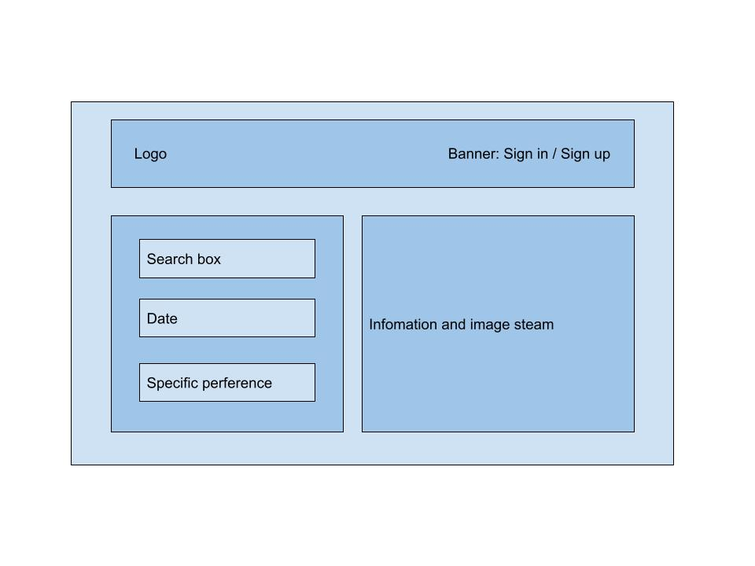

# Project Title: ShareRoom

## Summary

Nowadays, more and more travelers want to live in local houses instead of hotels for accommodation, this makes short period house renting popular. However, there still exists problems in these renting services. To make the travel experience better and safer, we would like to create a website which provides convenience for both tenants and landlords.

This website is a house rental website, which provides convenience for tenants to rent houses, and allows landlords to rent houses. This system provides options for long-term rental and short-term rental, and tenants can choose houses with different rental periods. This system has The co-tenancy function allows tenants to choose suitable co-tenant roommates online according to their preferences. This system has a credit point mechanism to evaluate landlords and tenants.

Our system's database will include information about tenants, landlords, houses, cities, most of which come from public real data, providing authenticity to our system.

## Project Description

Our system will function as a reciprocal coordinate system for both tenants and landlords. Not only can users easily find suitable accommodation on our platform, but landlords can also upload detailed housing details to our platform to avoid redundant actions such as sending pictures and details to different potential tenants. This will save a lot of time for both tenants and landlords and improve rental efficiency. 

Our unique roommate matching feature will further improve the user experience: when tenants see a desirable property, they don't need to worry about what to do with the extra rooms and worry about spending extra money, while landlords can rent out the whole property more quickly. Another problem that we want to address is how to ensure the credibility of tenants and landlords: our credit point mechanism will allow users to see each other's credit scores and comments from other users to have a better understanding of each other's credibility, and thus decides whether to rent to this person or whether to rent with this person.

## Usefulness

The application we selected is a rental application, which includes long rent, short rent and daily rent. The application can be targeted at many people who are seeking to rent their own houses and rent houses flexibly rather than for a long fixed period of time, such as one year or half one year. 
In fact, our application is similar to Airbnb (https://www.airbnb.com/). However, our application is obviously different from Airbnb in the following points.

Shared rental function
At present, on Airbnb, a tenant generally rents a whole house containing multiple rooms. Sometimes, a tenant only needs to rent one of the rooms. Therefore, we plan to develop the shared rental function. This function is designed to help tenants find similar tenants who are willing to share through gender, age and hobbies. For security reasons, the platform will verify key information such as age and gender before the start of shared rental. We believe this function can help tenants save rent and improve the utilization rate of their houses.
Credit points function
Another difference from Airbnb is that we plan to introduce a credit subsystem into our leasing system. Judging the credit ratings of tenants and landlords through past transaction records, a tenant with good credit will get better services, such as early check-in, late check-out, and no deposit. And a good credit landlord will be more likely to be recommended to tenants.

## Realness

We decide to utilize the AirBnB Listings (USA) dataset from the kaggle platform, which contains AirBnB listing of USA, and the link of this dataset is as followed.
https://www.kaggle.com/datasets/aishwaryamuthukumar/airbnb-listings-usa 
This AirBnB Listings (USA) dataset contains 224174 records and 89 fields in total, which includes lease price, room type, review scores rating and other information. The AirBnB Listings (USA) dataset is part of Airbnb Inside, and the original source can be found at http://insideairbnb.com/get-the-data/. And all data from the dataset is licensed under a Creative Commons Attribution 4.0 International License.

## Functionality 

First, the user should log in or register for a personal account. After the user clicks on the register button, the web page will go to the registration page. The front-end web page sends the user information to the back-end and stores it in the user table. After the user logs in, he/she can go to the rental page. This page will have a search bar on it. The user can enter a city and date range and the back-end system will return to the user the available properties. The user can then book or delete trips. In addition, users can also choose to share a room with someone, by setting gender, age, etc. in the advanced search in the search bar, they can share a room with someone who meets the criteria, with an automatic splitting system in the backend. Users can also rate their hosts and roommates.

## Low fidelity UI mockup 
### Welcome page

## Work distribution

Yangshen Chen: Design database structure and develop backend functions

Zihan Li: Implement database and develop backend functions

Zhengxu Jin: Develop front-end pages using react and design UI

Haotian Wang: Conduct data preprocessing and develop backend functions
